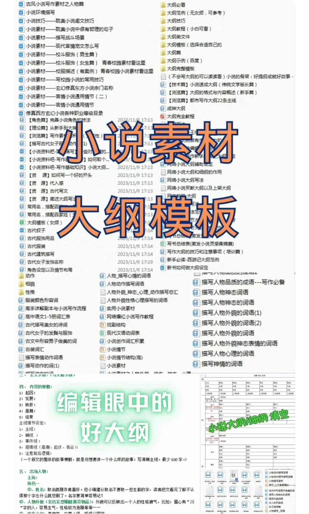

# Novels and novellas, novel materials, online novel outlines, beginner writing courses, and essential templates for writing novels are all resources that help authors enhance their writing skills and creativity. Here are some suggestions:

## Body

Novel Scrapbook Materials, Online Novel Writing Course, Beginner's Guide to Writing Novels, Must-Have Models for Writing Novels

(Full product description was not available from the source page.)

## Images

## Payment

Here is a pay link on Stripe ( https://buy.stripe.com/3cs8yP7sY87d0vu9AB ). Please contact me lonlonago@foxmail.com after funding $89, and I will send you a complete data files , thank you!

